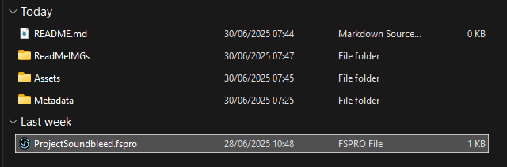
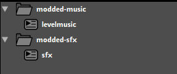

# Project Soundbleed for Sugary Spire

Welcome to the repository for *Project Soundbleed*, an FSPRO which is GUID-matched to be compatible with Sugary Spire: Exhibition Night. (This is *not* a recreation project.)

<a href="https://github.com/TheBerryBush/ProjectSoundbleed/">Project Soundbleed</a> © 2025 by <a href="https://github.com/TheBerryBush/">The Berry Bush</a> is licensed under <a href="https://creativecommons.org/licenses/by-nc/4.0/">Creative Commons Attribution-NonCommercial 4.0 International</a>

Need to learn the ropes? Follow this simple guide;

1. Open the project in an FMOD Studio version that starts with 2.02.

    

2. Make your new events. Two empty events have been included as examples; but feel free to remove them. (You may also remove the non-modded music, sfx, and Master banks too. They are included for completeness.)

   

3. Build the project for Desktop with F7.

4. Transfer the modded banks to Sugary Spire's sound folder. Do not transfer the non-modded music, sfx, and Master banks.

5. In `obj_fmod`'s Create Event, push your banks, including your modded Master, to the `banks` array before they are loaded. **Always place your modded banks LAST for full compatibility.**

Congratulations! You can now reference your events entirely normally. Happy FMODing!